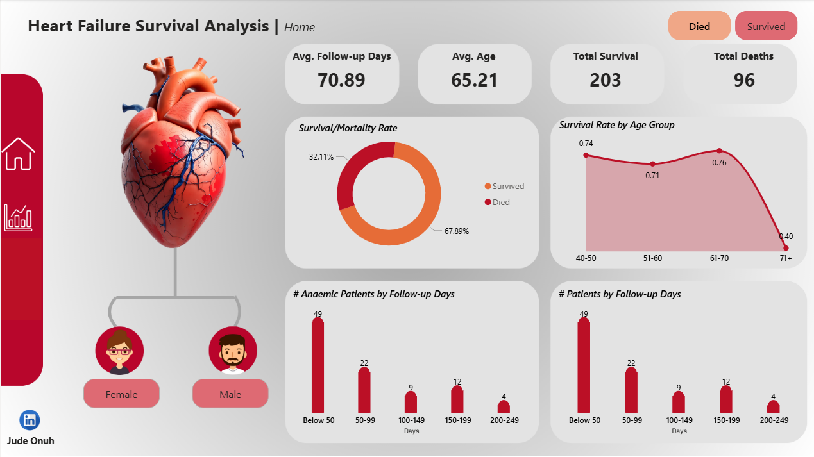
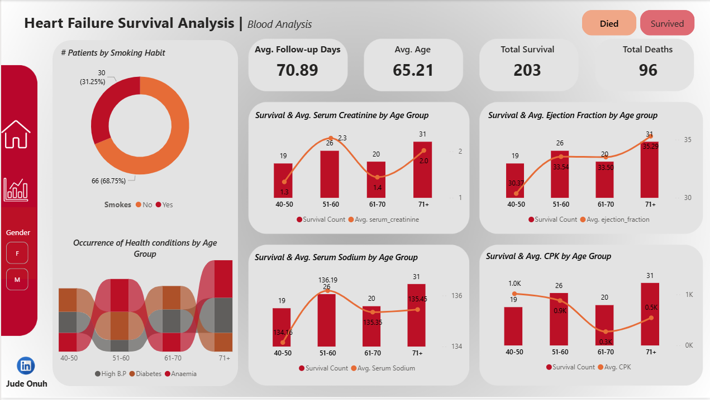

# Heart Failure Survival
This analysis presents an in-depth discussion of key findings derived from a survival analysis of a heart failure patient dataset. The analysis explores demographic, clinical, and behavioral factors associated with patient survival outcomes.

---

## Dashboard
An interactive dashboard for this analysis can be accessed [here](https://app.powerbi.com/view?r=eyJrIjoiMDhlNmJkNTAtZjQ4Yi00NTk2LWFjOWItNTAwYzJlZTZhMGIzIiwidCI6IjJjYzg3ZmM4LTY5NDQtNDUzMC1hNThlLTFjMDY0MTE4NTYzMCJ9)

---

## 📁 Table of Contents
- [Aim](#aim)
- [About the Dataset](#about-the-dataset)
- [Tools and Technologies](#tools-and-technologies)
- [Insights from Analysis](#insights-from-analysis)
- [Key Takeaways](#key-takeaways)
- [Next Steps](#next-steps)
- [Assumptions](#assumptions)
- [Conclusion](#conclusion)

---

## Aim
The goal of this analysis is to translate observations into clinically and operationally meaningful insights that can inform decision-making, risk stratification, and future modeling efforts.

---

## About the Dataset
- Source: Original dataset was obtained from the article below:
  > Chicco, D., & Jurman, G. (2020). Machine learning can predict survival of patients with heart failure from serum creatinine and ejection fraction alone.
  > BMC Medical Informatics and Decision Making, 20(1), 1-16.
- Format: xslx
- Key Fields:
  - age: age of the patient (years) 
  - anaemia: decrease of red blood cells or hemoglobin (boolean) 
  - creatinine phosphokinase (CPK): level of the CPK enzyme in the blood (mcg/L) 
  - diabetes: if the patient has diabetes (boolean) 
  - ejection fraction: percentage of blood leaving the heart at each contraction (percentage) 
  - high blood pressure: if the patient has hypertension (boolean) 
  - platelets: platelets in the blood (kiloplatelets/mL) 
  - sex: woman or man (binary) 
  - serum creatinine: level of serum creatinine in the blood (mg/dL) 
  - serum sodium: level of serum sodium in the blood (mEq/L) 
  - smoking: if the patient smokes or not (boolean) 
  - time: follow-up period (days)
  - [target] death event: if the patient died during the follow-up period (boolean) 

---

## Tools and Technologies
- Power Query for Data Cleaning.
- PowerBI for Visualisation. 

---

## Insights from Analysis
### 1. Overall Survival and Mortality Rates  
**Survival rate: 67.88%**  
**Mortality rate: 32.11%**  

- Approximately two-thirds of patients survived during the study period, while nearly one-third died. This mortality rate is substantial and consistent with expectations for heart failure cohorts, highlighting the severity and high-risk nature of the condition.
- This confirms heart failure as a **high-mortality disease**, emphasizing the need for early intervention and continuous monitoring.

---

### 2. Follow-up Duration by Outcome  
**Average follow-up (Survived): 158.34 days**  
**Average follow-up (Died): 70.89 days**  

- Patients who survived were followed up for more than twice as long as those who died. This suggests that frequent follow ups may influence survival in patients.
- This highlights the importance of:
  - Early-stage risk identification
  - Intensive care during the first 2–3 months post-diagnosis  

---

### 3. Average Age of Survivors by Gender  
**Male survivors: 66.87 years**  
**Female survivors: 62.18 years**  

- Female survivors are, on average, younger than male survivors. This may reflect biological differences, health-seeking behavior, or differing disease progression patterns between genders.
- Age and gender should be treated as **interacting variables** rather than independent predictors.
- This suggests further investigation into:
  - Hormonal or biological protective factors
  - Differences in comorbidity burden between genders

---

### 4. Anaemia, Mortality, and Follow-up Duration  
- **Observation:** The number of patients who died and/or had anaemia decreased as follow-up days increased.
- Patients with anaemia appear to be at higher risk of earlier death, leading to fewer anaemic patients being observed at longer follow-up durations.
- Anaemia is likely a **marker of disease severity** rather than a benign comorbidity.
- Early detection and management of anaemia may improve survival outcomes.
- Strong justification for including anaemia as a **high-importance feature** in predictive models.

---

### 5. Survival Rate by Age and Gender  
- Survival rate decreases with increasing age.
- **Peak survival**:
  - Males: 61–70 years
  - Females: 40–50 years
- **Lowest survival**: 71+ age group (both genders)
- Age is a dominant risk factor, with a clear negative relationship between age and survival. The different peak survival ranges suggest gender-specific aging effects.
- Age should be modeled as a non-linear variable
- Patients aged 71+ represent a **high-risk population** requiring targeted interventions.
- Gender-stratified age thresholds may improve model accuracy and clinical relevance.

---

  

### 6. Smoking Patterns Among Survivors  
**49.24% of male survivors smoke**
**~1% of female survivors smoke**
- Smoking prevalence among male survivors is extremely high compared to females. This reflects strong gender-based behavioral differences rather than survival advantage.
- Smoking is a **gender-skewed risk factor** in this dataset.
- For males, smoking cessation programs may have significant impact.
- For females, smoking may not be a statistically strong predictor due to low prevalence.

---

### 7. Age vs Ejection Fraction and Serum Creatinine  
**Observation:**  
- Ejection fraction and serum creatinine increase with age in both males and females. This means that increasing age is associated with:
  - Worsening cardiac function (ejection fraction changes)
  - Declining kidney function (higher serum creatinine)
- This aligns with known physiological aging and disease progression patterns.
- Age-related physiological decline must be accounted for in clinical assessment.
- Reinforces the interconnected nature of:
  - Cardiac health
  - Renal function

---

## 8. Comorbidities and Survival Outcome  
**Observation:** Patients who survived had lower occurrences of:
  - Anaemia
  - High blood pressure
- The presence of these comorbidities is strongly associated with mortality, likely reflecting both disease severity and cumulative health burden.
- Patients with multiple conditions may benefit from:
  - Closer monitoring
  - Multidisciplinary care

---

## Key Takeaways
- Age, anaemia, blood pressure, and renal function are critical survival determinants.
- Early mortality risk is substantial and concentrated in the first few months.
- Gender differences influence age, smoking behavior, and survival patterns.
- Descriptive survival analysis provides strong groundwork for:
  - Predictive modeling
  - Clinical decision support systems
  - Policy and intervention planning

---

## Next Steps
- Apply **Kaplan–Meier survival curves** for time-to-event analysis.
- Build a **Cox proportional hazards model** to quantify risk contributions.
- Develop a **risk scoring system** for early patient stratification.

---

## Assumptions
The following assumptions underpin this analysis:

1. **Data Accuracy**  
   All clinical measurements, comorbidity indicators, and survival outcomes are assumed to be correctly recorded and free from systematic errors.
2. **Binary Survival Outcome**  
   Survival is treated as a binary outcome (`Yes` / `No`), without accounting for cause-specific mortality.
3. **Uniform Follow-up Interpretation**  
   Follow-up days are assumed to be comparable across patients, despite potential variations in visit schedules or monitoring intensity.
4. **Static Features**  
   Clinical variables (e.g., blood pressure, anaemia status) are assumed to be static, even though they may change over time in real-world settings.
5. **No Treatment Effect Modeling**  
   Differences in medication, procedures, or care quality are not explicitly modeled.

---

## Conclusion
This survival analysis highlights the multifactorial nature of outcomes in heart failure patients, with age, comorbidities, and physiological markers playing central roles in determining survival. The findings show a clear pattern of early mortality, particularly among older patients and those with anaemia, hypertension, or impaired renal and cardiac function. Pronounced gender differences in age, smoking behavior, and survival trends further emphasize the need for stratified analysis rather than one-size-fits-all approaches. While the analysis is descriptive in nature, it provides a strong evidence-based foundation for targeted clinical interventions, risk stratification, and the development of more robust time-to-event and predictive models to support improved patient outcomes.
